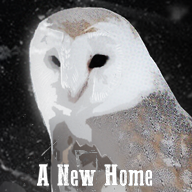

<h2> About </h2>

A New Home is a game about an owl that travels from a destroyed forest to find it's new home. 
Currently features total of 6 prototype levels. 

<h2> Notes </h2>
<ul>
  <li>Project uses CocosSharp v. 1.6.2. game engine, note that current versions of CocosSharp are not supported.</li>
  <li> Uses <a ="https://www.mapeditor.org/">Tiled</a> for level generation.</li>
  <li> XML Sheet is used for determining sprite position and animation sequence</li>
</ul>
